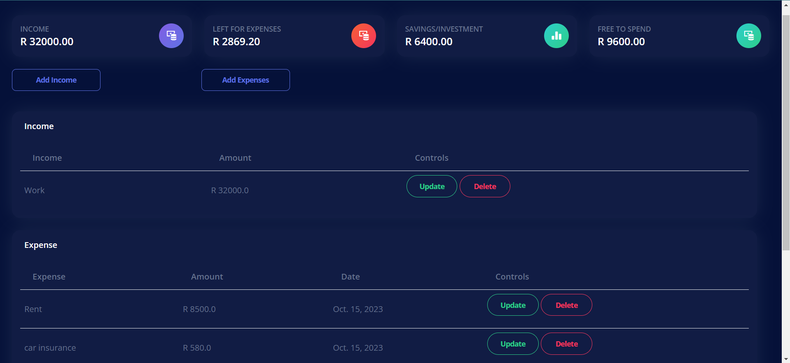

# Finance-IO
Full stack Django web app to allow the user to manage their finances.

## Design
 

## Tools used: 
- Bootstrap 5
- Html, CSS, Javascript
- MySQL

## About 
Finance IO is a full-stack web application that was made with the idea of helping users keep track of their finances.  

## Features
Helps users manage their finances using the 50/30/20 rule 

